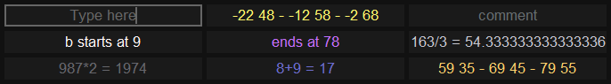

dj-calculator
=============

Pretty calculation evaluator for quick math needed while lining up tracks.

I created this desktop app so I could jot bar notes as I was mixing music with Serato DJ.
The most fun part of DJ'ing is figuring out how two completely different songs can be mixed together.
So, this application helped me by giving me a place to put notes about the beginning and
ends of tracks so I could queue up the next track in the perfect place for a seamless transition.

Made for windows specifically so we can take advantage of always-on-top and borderless toplevel windows.

Use Alt-F4 to exit, and launch with `pythonw.exe app.py` to avoid the console.
